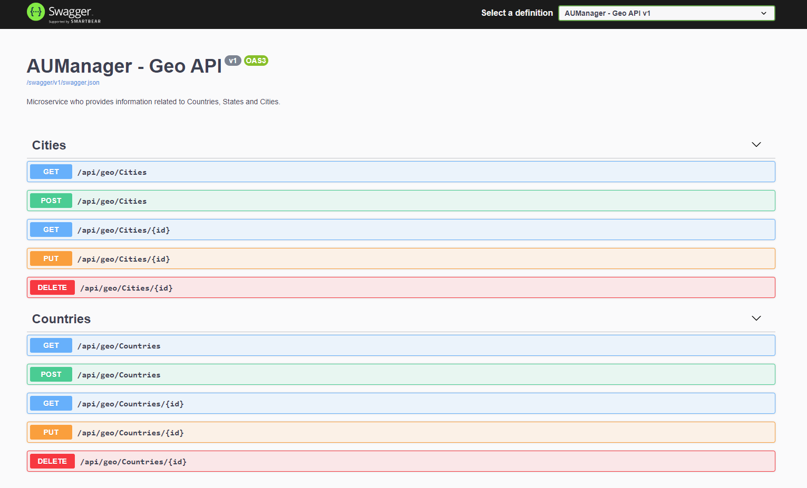

# Introduction 
AU Manager is a fictitious microservice-based application created and utilized by Americas University (also, a fictitious company) to manage internal aspects of the company. This repository holds the source code of one of the microservices comprised by AUManager.

# Microservice: AUManager - Geo (aumanager-geo)

"AUManager - Geo" API (RESTFul) implement basic operations related to the geographic aspect of the application: **Countries**, **States** and **Cities**. It is Web API project written in .NET Core 3.1.

Some of the operations implemented by this repository can be seen below:

1.	Create, Read, Update and Delete (CRUD) for Countries.
2.	Create, Read, Update and Delete (CRUD) for States.
3.	Create, Read, Update and Delete (CRUD) for Cities.

# What is included?

* **aumanager-geo**: Project's base. It does implement the Web API on top of MVC pattern. It also handles the App + Azure Active Directory authentication and authorization flow. It also communicates with underlying projects to access data and infrastructure aspects.
* **aumanager-geo-core**: It does decouple the Web API's controllers and further aspects from the data layer services. It also defines database entities (to serve EF code-first).
* **aumanager-geo-infra**: Brings to life the various routines in the system returning its results backwards to the callers.

# Dependencies

The application here described was developed considering the follow technologies and services. Please, make sure you have everything in place before to get started.

* **Azure Active Directory**: In order to perform authentication and authorization, this API dependes on App's registration onto Azure AD, as described [in this tutorial](https://docs.microsoft.com/en-us/samples/azure-samples/active-directory-dotnet-webapp-webapi-openidconnect-aspnetcore/calling-a-web-api-in-an-aspnet-core-web-application-using-azure-ad/).
* **SQL Server**: Every microservice in the architecture has its own database. The one used by this service is SQL Server.
* **.NET Core 3.1**: This service is written in .NET Core 3.1, which means you have to have it installed and configured in your machine to be able to reproduce it. [Here's how to get it done](https://dotnet.microsoft.com/download/dotnet/3.1).
* **Docker**: The project brings a Docker file that allows you to package this app into a container image and push it out to your preferred Container Registry.

# Resources

Useful resources available for you to get started with the environment.

* **WebApp's deployment script**: Azure CLI-based script for you to deploy the hosting for the service in Azure. ([WebApp](iac/deploy-webapp.azcli))
* **Countries**: CSV file with all the countries in the World to populate "Countries" table in the database. ([Donwload](res/countries.csv))
* **States**: CSV file with all the states in the World to populate "States" table in the database. ([Donwload](res/states.csv))
* **Cities**: CSV file with all the cities in the World to populate "Cities" table in the database. ([Donwload](res/cities.csv)).